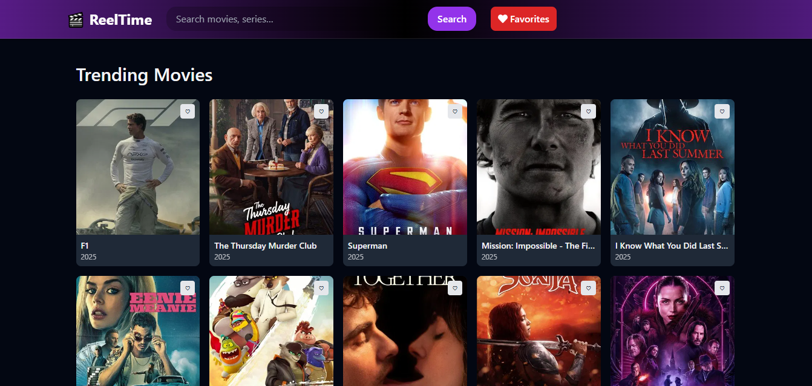

# 🎬 Reeltime Movie App

A simple and modern movie search app built with **React** and the [TMDb API](https://www.themoviedb.org/documentation/api).  
Users can search for movies, view details such as release date, ratings, and descriptions, and enjoy a clean, responsive UI.

---

## 🚀 Features
- 🔎 Search for movies by title  
- 🖼️ Display posters, release date, rating, and overview  
- 📱 Responsive design for desktop and mobile  
- ⚡ Fast and lightweight (built with React + Vite)  
- 🎨 Simple, clean, and modern interface  

---

## 🖼️ Demo Screenshot


---
## 🛠️ Installation & Setup

1. **Clone the repository**
   ```bash
   git clone https://github.com/Icyln/reeltime-movie.git
   cd reeltime-movie
